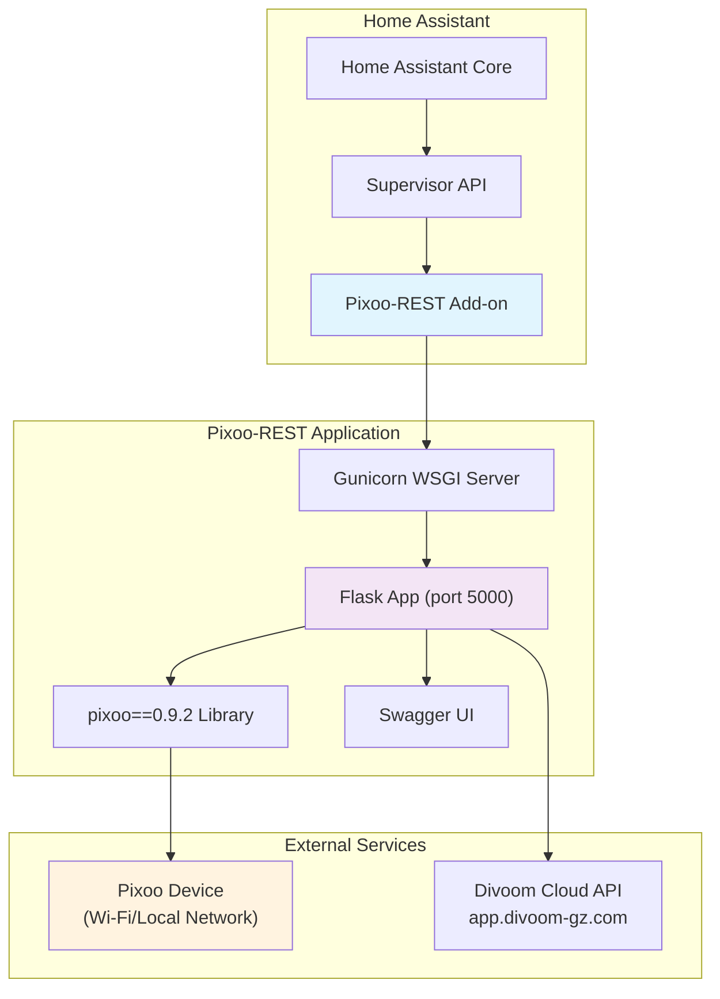
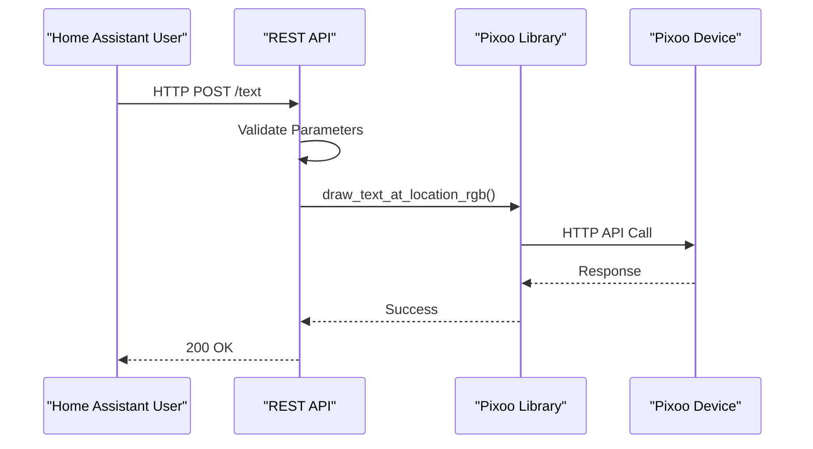

# Agents and Documentation

This document provides comprehensive information about the pixoo-rest Home Assistant add-on, its architecture, capabilities, and usage patterns.

## Table of Contents

1. [Overview](#overview)
2. [Architecture](#architecture)
3. [API Reference](#api-reference)
4. [Configuration](#configuration)
5. [Deployment](#deployment)
6. [Development](#development)
7. [Integration Examples](#integration-examples)

---

## Overview

### What is Pixoo-REST?

Pixoo-REST is a RESTful API gateway that enables easy interaction with Divoom Pixoo LED display devices (Pixoo 64x64, 32x32, 16x16) through Home Assistant. It provides:

- **Swagger UI**: Interactive API documentation and testing
- **RESTful Endpoints**: Simple HTTP API for drawing, content management, and device control
- **Pass-through Commands**: Direct access to native Pixoo device API
- **Home Assistant Integration**: Seamless integration as an add-on
- **Content Management**: Automatic image/GIF downloading and display
- **Cloud Integration**: Access to Divoom cloud services

### Current Version

- **pixoo-rest**: v1.6.0 (2024-08-28)
- **Add-on Version**: v0.1.0
- **Base Image**: Home Assistant Python 3.13 Alpine 3.20

### Key Features

#### Drawing Operations
- Pixel, line, rectangle, text, and character drawing
- RGB color support (0-255 per channel)
- Screen fill and buffer management
- Immediate or batched rendering

#### Content Management
- Static image and animated GIF display
- External content downloading from URLs
- Automatic format conversion and resizing
- Frame limiting for GIFs (max 59-60 frames)

#### Device Control
- Brightness control (0-100%)
- Channel/mode selection
- Screen rotation and mirroring
- Time and weather configuration
- Temperature units (Celsius/Fahrenheit)
- Built-in tools (timer, stopwatch, scoreboard)

#### Advanced Features
- JSON pass-through for direct device commands
- Divoom cloud API integration
- Batch text operations (sendHttpItemList)
- Home automation friendly endpoints

---

## Architecture

### System Components



### Technology Stack

| Component | Version | Purpose |
|-----------|---------|---------|
| **Flask** | 3.0.3 | Web framework and routing |
| **pixoo** | 0.9.2 | Pixoo device communication library |
| **Pillow** | 10.4.0 | Image processing and format conversion |
| **requests** | 2.32.3 | HTTP client for external APIs |
| **gunicorn** | 23.0.0 | Production WSGI server |
| **flasgger** | 0.9.7.2.dev2 | Swagger/OpenAPI documentation |
| **python-dotenv** | 1.0.1 | Environment configuration |

### Request Flow



---

## API Reference

### Base URL

When running as a Home Assistant add-on:
```
http://homeassistant.local:5000
```

From within Home Assistant (via Ingress - coming in future updates):
```
http://homeassistant.local:8123/api/hassio_ingress/<addon_slug>
```

### Core Endpoint Categories

#### 1. Drawing Operations

| Endpoint | Method | Description | Key Parameters |
|----------|--------|-------------|----------------|
| `/pixel` | POST | Draw single pixel | `x`, `y`, `r`, `g`, `b`, `push_immediately` |
| `/line` | POST | Draw line | `start_x`, `start_y`, `stop_x`, `stop_y`, `r`, `g`, `b` |
| `/rectangle` | POST | Draw filled rectangle | `top_left_x/y`, `bottom_right_x/y`, `r`, `g`, `b` |
| `/text` | POST | Draw text | `text`, `x`, `y`, `r`, `g`, `b` |
| `/character` | POST | Draw single character | `character`, `x`, `y`, `r`, `g`, `b` |
| `/image` | POST | Display image | `image` (file), `x`, `y` |
| `/fill` | POST | Fill screen with color | `r`, `g`, `b` |

**Example: Drawing Text**
```bash
curl -X POST \
  -d "text=Hello&x=10&y=10&r=255&g=255&b=255&push_immediately=true" \
  http://homeassistant.local:5000/text
```

#### 2. Device Control

| Endpoint | Method | Description | Parameters |
|----------|--------|-------------|------------|
| `/brightness/<percentage>` | PUT | Set brightness | `percentage`: 0-100 |
| `/channel/<number>` | PUT | Set channel | `number`: channel index |
| `/face/<number>` | PUT | Set clock face | `number`: face index |
| `/visualizer/<number>` | PUT | Set visualizer | `number`: visualizer index |
| `/clock/<number>` | PUT | Set clock | `number`: clock index |
| `/screen/on/<boolean>` | PUT | Turn screen on/off | `boolean`: true/false |

**Example: Setting Brightness**
```bash
curl -X PUT http://homeassistant.local:5000/brightness/75
```

#### 3. Content Management

| Endpoint | Method | Description | Parameters |
|----------|--------|-------------|------------|
| `/sendGif` | POST | Upload and display GIF | `gif` (file), `speed`, `skip_first_frame` |
| `/sendText` | POST | Send text message | `text`, `x`, `y`, `r`, `g`, `b`, `font`, etc. |
| `/download/gif` | POST | Download GIF from URL | `url`, `speed`, `timeout`, `ssl_verify` |
| `/download/image` | POST | Download image from URL | `url`, `x`, `y`, `timeout` |
| `/download/text` | POST | Download text from URL | `url`, `x`, `y`, scroll parameters |

**Example: Downloading and Displaying Image**
```bash
curl -X POST \
  -d "url=https://example.com/image.png&x=0&y=0&timeout=30" \
  http://homeassistant.local:5000/download/image
```

#### 4. Passthrough Commands

Direct JSON commands to the Pixoo device's native API:

| Category | Example Commands |
|----------|-----------------|
| **Channel** | SetIndex, SetBrightness, OnOffScreen |
| **System** | LogAndLat, TimeZone, SetUTC |
| **Device** | SetScreenRotationAngle, SetMirrorMode, SetTime24Flag |
| **Tools** | SetTimer, SetStopWatch, SetScoreBoard |
| **Draw** | SendHttpText, SendHttpGif, SendHttpItemList |

**Example: Passthrough Command**
```bash
curl -X POST \
  -H "Content-Type: application/json" \
  -d '{"Command":"Device/SetScreenRotationAngle","Mode":1}' \
  http://homeassistant.local:5000/passthrough/device/SetScreenRotationAngle
```

#### 5. Divoom Cloud API

| Endpoint | Description | Purpose |
|----------|-------------|---------|
| `/divoom/device/lan` | Find devices on LAN | Device discovery |
| `/divoom/channel/dial/types` | Get dial categories | Clock face categories |
| `/divoom/channel/dial/list` | List dials by type | Browse clock faces |

### Common Parameters

| Parameter | Type | Range | Default | Description |
|-----------|------|-------|---------|-------------|
| `x` | integer | 0-63 | 0 | Horizontal position |
| `y` | integer | 0-63 | 0 | Vertical position |
| `r` | integer | 0-255 | 255 | Red color value |
| `g` | integer | 0-255 | 255 | Green color value |
| `b` | integer | 0-255 | 255 | Blue color value |
| `push_immediately` | boolean | - | true | Push to device immediately |
| `timeout` | integer | 3-300 | 30 | Connection timeout (seconds) |
| `ssl_verify` | boolean | - | true | Verify SSL certificates |

---

## Configuration

### Add-on Configuration Options

Located in Home Assistant: **Settings** → **Add-ons** → **Pixoo Rest** → **Configuration**

```yaml
# Automatic device discovery (recommended)
PIXOO_HOST_AUTO: true

# Manual device IP (used when PIXOO_HOST_AUTO is false)
PIXOO_HOST: "192.168.1.100"

# Enable debug mode
PIXOO_DEBUG: false

# Screen size (16, 32, or 64)
PIXOO_SCREEN_SIZE: 64
```

### Configuration Parameters Explained

| Option | Type | Default | Description |
|--------|------|---------|-------------|
| `PIXOO_HOST_AUTO` | boolean | `true` | Automatically discover Pixoo device on LAN using Divoom cloud API |
| `PIXOO_HOST` | string | - | Manual IP address (required if auto-discovery disabled) |
| `PIXOO_DEBUG` | boolean | `false` | Enable detailed logging from pixoo library |
| `PIXOO_SCREEN_SIZE` | integer | `64` | Screen resolution (16, 32, or 64 pixels) |

### Environment Variables (Advanced)

These are set internally by the add-on but can be customized in development:

```bash
# Flask server configuration
PIXOO_REST_HOST=0.0.0.0
PIXOO_REST_PORT=5000
PIXOO_REST_DEBUG=false

# Connection retry attempts on startup
PIXOO_TEST_CONNECTION_RETRIES=10

# WSGI base path (for reverse proxy)
SCRIPT_NAME=/pixoo-rest
```

### Device Discovery

The add-on uses Divoom's cloud API to automatically find Pixoo devices on your local network:

```bash
curl -X POST https://app.divoom-gz.com/Device/ReturnSameLANDevice
```

Response includes:
- Device IP address (DevicePrivateIP)
- Device name
- Device type and capabilities

---

## Deployment

### Home Assistant Add-on (Recommended)

1. **Add Repository**
   ```
   Settings → Add-ons → Add-on Store → ⋮ → Repositories
   Add: https://github.com/kmplngj/ha-addons
   ```

2. **Install Add-on**
   - Find "Pixoo Rest" in the store
   - Click "Install"
   - Wait for installation to complete

3. **Configure**
   - Go to Configuration tab
   - Enable PIXOO_HOST_AUTO or set manual IP
   - Configure screen size
   - Click "Save"

4. **Start Add-on**
   - Go to Info tab
   - Click "Start"
   - Optionally enable "Start on boot"
   - Optionally enable "Watchdog"

5. **Access Swagger UI**
   ```
   http://homeassistant.local:5000
   ```

### Docker Deployment

```bash
docker run -d \
  --name pixoo-rest \
  -p 5000:5000 \
  -e PIXOO_HOST=192.168.1.100 \
  -e PIXOO_SCREEN_SIZE=64 \
  --restart unless-stopped \
  4ch1m/pixoo-rest:latest
```

### Docker Compose

```yaml
version: '3'
services:
  app:
    image: 4ch1m/pixoo-rest:latest
    ports:
      - "${PIXOO_REST_PORT:-5000}:5000"
    environment:
      TZ: ${TZ:-Europe/Berlin}
      PIXOO_DEBUG: ${PIXOO_DEBUG:-false}
      PIXOO_REST_DEBUG: ${PIXOO_REST_DEBUG:-false}
      PIXOO_HOST: ${PIXOO_HOST:-pixoo}
      PIXOO_SCREEN_SIZE: ${PIXOO_SCREEN_SIZE:-64}
    restart: unless-stopped
```

---

## Development

### Local Development Setup

```bash
# Clone repository
git clone https://github.com/4ch1m/pixoo-rest.git
cd pixoo-rest

# Create virtual environment
python3 -m venv venv
source venv/bin/activate  # Linux/Mac
# or
venv\Scripts\activate  # Windows

# Install dependencies
pip install -r requirements.txt

# Create .env file
cat > .env << EOF
PIXOO_HOST=192.168.1.100
PIXOO_SCREEN_SIZE=64
PIXOO_DEBUG=true
PIXOO_REST_DEBUG=true
PIXOO_REST_HOST=0.0.0.0
PIXOO_REST_PORT=5000
EOF

# Run application
python app.py
```

### Project Structure

```
pixoo-rest/
├── app.py                  # Main Flask application
├── _helpers.py             # Utility functions
├── requirements.txt        # Python dependencies
├── version.txt            # Current version
├── Dockerfile             # Docker build configuration
├── docker-compose.yml     # Docker Compose setup
├── swag/                  # Swagger/OpenAPI definitions
│   ├── definitions.py     # Common parameter definitions
│   ├── passthrough.py     # Passthrough command specs
│   ├── draw/             # Drawing operation specs
│   ├── send/             # Content sending specs
│   ├── download/         # Download operation specs
│   └── divoom/           # Cloud API specs
├── examples/             # Usage examples
│   ├── clockwise_swipe.sh
│   └── progress_bar.sh
└── helm/                 # Kubernetes Helm charts
    ├── Chart.yaml
    ├── values.yaml
    └── templates/
```

### Adding New Endpoints

1. **Define Route in `app.py`**
```python
@app.route('/my-endpoint', methods=['POST'])
@swag_from('swag/my-endpoint.yml')
def my_endpoint():
    # Implementation
    return 'OK'
```

2. **Create Swagger Documentation**
```yaml
# swag/my-endpoint.yml
description: My endpoint description
parameters:
  - name: my_param
    in: formData
    type: string
    required: true
responses:
  '200':
    description: Success
tags:
  - my-category
```

3. **Update `CHANGELOG.md`** and `version.txt`

---

## Integration Examples

### Home Assistant Automations

#### Example 1: Display Time on Motion

```yaml
automation:
  - alias: "Show Time on Pixoo when Motion Detected"
    trigger:
      - platform: state
        entity_id: binary_sensor.motion_sensor
        to: "on"
    action:
      - service: rest_command.pixoo_show_time
        data:
          text: "{{ now().strftime('%H:%M') }}"

rest_command:
  pixoo_show_time:
    url: "http://homeassistant.local:5000/text"
    method: POST
    payload: "text={{ text }}&x=10&y=10&r=255&g=255&b=255&push_immediately=true"
```

#### Example 2: Weather Display

```yaml
automation:
  - alias: "Update Weather on Pixoo"
    trigger:
      - platform: time_pattern
        minutes: "/30"
    action:
      - service: rest_command.pixoo_weather
        data:
          temp: "{{ states('sensor.outdoor_temperature') }}"
          condition: "{{ states('sensor.weather_condition') }}"

rest_command:
  pixoo_weather:
    url: "http://homeassistant.local:5000/download/image"
    method: POST
    payload: "url=https://example.com/weather/{{ condition }}.png&x=0&y=0"
```

#### Example 3: Progress Bar for Battery Level

```yaml
automation:
  - alias: "Show Battery Level on Pixoo"
    trigger:
      - platform: state
        entity_id: sensor.phone_battery
    action:
      - service: rest_command.pixoo_battery_bar
        data:
          level: "{{ states('sensor.phone_battery') | int }}"

rest_command:
  pixoo_battery_bar:
    url: "http://homeassistant.local:5000/rectangle"
    method: POST
    payload: >-
      top_left_x=0&top_left_y={{ 64 - (64 * level / 100) | int }}&
      bottom_right_x=63&bottom_right_y=63&
      r=0&g=255&b=0&push_immediately=true
```

### Shell Script Examples

#### Clockwise Swipe Animation

```bash
#!/bin/bash
PIXOO_REST_URL="http://homeassistant.local:5000"

# Draw lines from center rotating clockwise
for i in {-1..64}; do
  curl -s -X POST \
    -d "start_x=32&start_y=32&stop_x=${i}&stop_y=-1&r=255&g=0&b=0&push_immediately=true" \
    "${PIXOO_REST_URL}/line"
  sleep 0.01
done
```

#### Progress Bar Display

```bash
#!/bin/bash
PIXOO_REST_URL="http://homeassistant.local:5000"

function show_progress() {
  local percent=$1
  
  # Black background
  curl -s -X POST -d "r=0&g=0&b=0&push_immediately=false" \
    "${PIXOO_REST_URL}/fill"
  
  # Red progress bar
  local height=$((64 * percent / 100))
  curl -s -X POST \
    -d "top_left_x=0&top_left_y=$((64-height))&bottom_right_x=63&bottom_right_y=63&r=255&g=0&b=0&push_immediately=false" \
    "${PIXOO_REST_URL}/rectangle"
  
  # White text overlay
  curl -s -X POST \
    -d "text=${percent}%25&x=20&y=28&r=255&g=255&b=255&push_immediately=true" \
    "${PIXOO_REST_URL}/text"
}

# Show 75% progress
show_progress 75
```

### Python Integration

```python
import requests

class PixooClient:
    def __init__(self, host="homeassistant.local", port=5000):
        self.base_url = f"http://{host}:{port}"
    
    def draw_text(self, text, x=0, y=0, r=255, g=255, b=255):
        """Draw text on Pixoo display"""
        response = requests.post(
            f"{self.base_url}/text",
            data={
                "text": text,
                "x": x,
                "y": y,
                "r": r,
                "g": g,
                "b": b,
                "push_immediately": "true"
            }
        )
        return response.status_code == 200
    
    def set_brightness(self, percentage):
        """Set display brightness"""
        response = requests.put(f"{self.base_url}/brightness/{percentage}")
        return response.status_code == 200
    
    def download_image(self, url, x=0, y=0):
        """Download and display image from URL"""
        response = requests.post(
            f"{self.base_url}/download/image",
            data={
                "url": url,
                "x": x,
                "y": y
            }
        )
        return response.status_code == 200

# Usage
pixoo = PixooClient()
pixoo.draw_text("Hello World", x=10, y=10)
pixoo.set_brightness(75)
pixoo.download_image("https://example.com/image.png")
```

---

## Troubleshooting

### Common Issues

#### Add-on won't start
1. Check logs: Settings → Add-ons → Pixoo Rest → Log
2. Verify Pixoo device is powered on and connected to Wi-Fi
3. Check network connectivity between Home Assistant and Pixoo
4. Try manual IP instead of auto-discovery

#### Device not found
1. Ensure Pixoo device is on the same network as Home Assistant
2. Check firewall settings
3. Try manual IP configuration
4. Verify device is not in sleep mode

#### API calls timeout
1. Increase timeout parameter in requests
2. Check Pixoo device responsiveness
3. Verify network stability
4. Check for firmware updates on Pixoo device

### Debug Mode

Enable debug logging for detailed troubleshooting:

```yaml
PIXOO_DEBUG: true
PIXOO_REST_DEBUG: true
```

View logs in Home Assistant:
```
Settings → Add-ons → Pixoo Rest → Log
```

---

## Resources

### Official Links
- **pixoo-rest GitHub**: https://github.com/4ch1m/pixoo-rest
- **pixoo Library**: https://github.com/SomethingWithComputers/pixoo
- **Home Assistant Add-on Docs**: https://developers.home-assistant.io/docs/add-ons/

### Community
- **Home Assistant Forum**: https://community.home-assistant.io/
- **GitHub Issues**: https://github.com/kmplngj/ha-addons/issues

### API Documentation
- **Divoom API**: http://doc.divoom-gz.com/web/#/12?page_id=143
- **Swagger UI**: http://homeassistant.local:5000 (when add-on is running)

---

## License

This project is licensed under the MIT License. See the original pixoo-rest project for details:
- https://github.com/4ch1m/pixoo-rest/blob/main/LICENSE

---

## Credits

- **pixoo-rest** by [4ch1m](https://github.com/4ch1m)
- **pixoo library** by [SomethingWithComputers](https://github.com/SomethingWithComputers)
- **Home Assistant Add-on** maintained by [@kmplngj](https://github.com/kmplngj)

---

*Last Updated: 2024-11-09*
